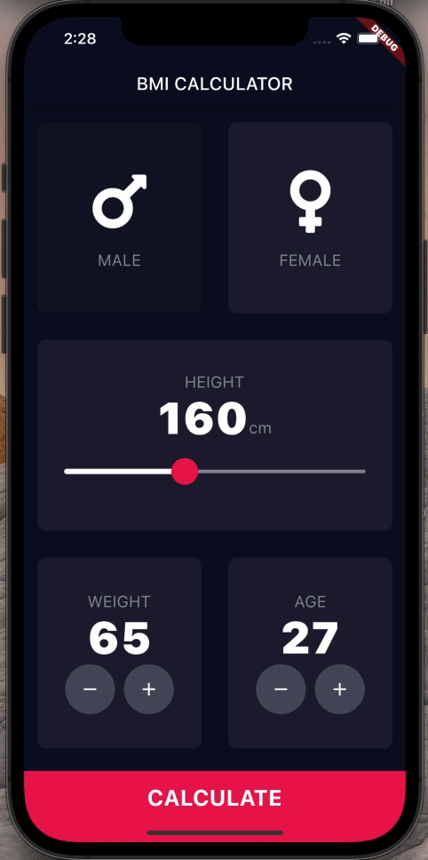

# BMI Calculator

## Goal
Build an beautiful user interface designs for a BMI calculator.

## The App
A simple BMI calculator.

## Features
- Flutter themes;
- Multi-page apps using Flutter Routes and Navigator;
- Extract and refactor Flutter Widgets with a click of the button;
- GestureDetector Widget;
- Custom colour palettes by using hex codes;
- Customised Flutter Widgets.
